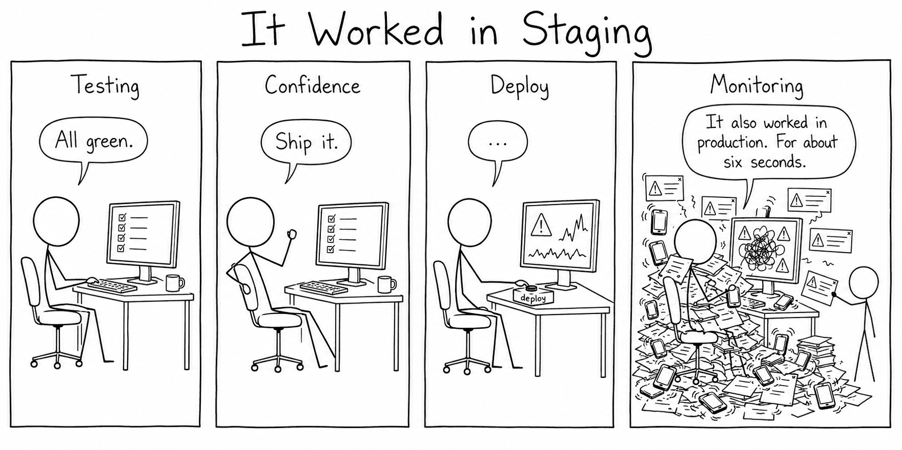
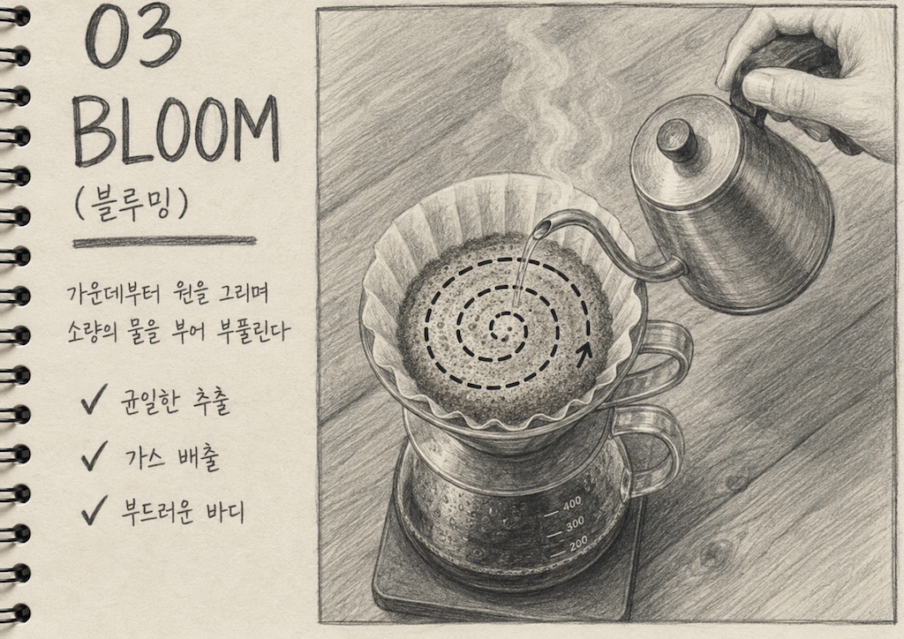
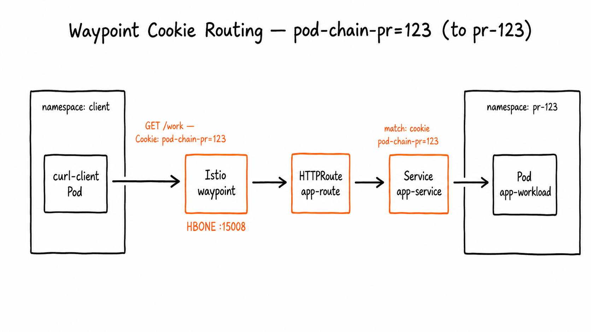

# akbun-aitools

akbun tools for both Claude Code and Codex plugin workflows.

## plugin 목록

설치 가능한 plugin과 각 plugin이 제공하는 skill이다. plugin이나 skill을 추가/삭제하면 이 목록도 함께 갱신한다(`AGENTS.md`의 플러그인 변경 규칙 참고).

### akbun-writing

글쓰기, 리뷰, 블로그 발행, 다이어그램 지원 skill 모음.

| skill | 설명 |
|---|---|
| [akbun-writing](./plugins/akbun-writing/skills/akbun-writing/) | akbun 스타일 한국어 기술 블로그 작성·확장 |
| [akbun-writing-with-question](./plugins/akbun-writing/skills/akbun-writing-with-question/) | 질문 기반 akbun 스타일 학습형 블로그 작성 |
| [akbun-writing-persuasive](./plugins/akbun-writing/skills/akbun-writing-persuasive/) | 독자가 끝까지 읽고 납득하도록 설득식 구조로 akbun 스타일 블로그 작성 |
| [akbun-blog-post-template](./plugins/akbun-writing/skills/akbun-blog-post-template/) | 기술 블로그 포스트 문서틀(목차·구조) 생성 |
| [akbun-hands-on](./plugins/akbun-writing/skills/akbun-hands-on/) | GitHub 실습용 명령어 위주 핸즈온 뼈대(각본) 작성 |
| [akbun-make-questions](./plugins/akbun-writing/skills/akbun-make-questions/) | 기술 노트에서 학습 질문 생성·관리 |
| [akbun-docs-reviewer](./plugins/akbun-writing/skills/akbun-docs-reviewer/) | 한국어 기술 문서 교정·용어 표기 표준화 리뷰 |
| [akbun-markdown-to-html-pandoc](./plugins/akbun-writing/skills/akbun-markdown-to-html-pandoc/) | Obsidian markdown을 pandoc으로 HTML 변환(블로그 업로드) |
| [akbun-md-to-notion](./plugins/akbun-writing/skills/akbun-md-to-notion/) | Obsidian markdown을 Notion Tasks DB로 전송 |
| [akbun-drawio-aws-vpc](./plugins/akbun-writing/skills/akbun-drawio-aws-vpc/) | draw.io로 AWS VPC 기초 다이어그램 생성 |
| [kubernets-network-drawio](./plugins/akbun-writing/skills/kubernets-network-drawio/) | draw.io로 Kubernetes 네트워크 다이어그램 생성 |
| [akbun-generateimage-code](./plugins/akbun-writing/skills/akbun-generateimage-code/) | 코드 설명용 블로그 figure의 이미지 생성 프롬프트 작성 |
| [akbun-draw-component](./plugins/akbun-writing/skills/akbun-draw-component/) | 코드·컴퍼넌트를 분석해 하이레벨 아키텍처/연관관계 그림의 이미지 생성 프롬프트 작성 |
| [akbun-draw-network-relationship](./plugins/akbun-writing/skills/akbun-draw-network-relationship/) | 컴퍼넌트 간 네트워크 흐름 그림의 이미지 생성 프롬프트 작성 |
| [akbun-generate-headline](./plugins/akbun-writing/skills/akbun-generate-headline/) | 넘긴 내용·파일을 분석해 클릭을 부르는 헤드라인(글 제목) 후보 생성 |
| [akbun-draw-webtoon](./plugins/akbun-writing/skills/akbun-draw-webtoon/) | 사용자 내용을 3~4컷 흑백 스틱피겨 웹툰의 이미지 생성 프롬프트로 작성 |
| [akbun-generate-sketch-text](./plugins/akbun-writing/skills/akbun-generate-sketch-text/) | 문구를 린넨 원단 자수 텍스트 + 형광펜 강조 스타일의 이미지 생성 프롬프트로 작성 |
| [akbun-draw-sketchbook-card](./plugins/akbun-writing/skills/akbun-draw-sketchbook-card/) | 개념을 연필 스케치북 카드(손글씨 제목·체크리스트+일러스트)로 그리는 이미지 생성 프롬프트 작성 |
| [akbun-draw-storytellingimage](./plugins/akbun-writing/skills/akbun-draw-storytellingimage/) | 이야기를 장면별 손그림 마커 스케치 삽화의 이미지 생성 프롬프트로 작성 |
| [akbun-draw-search-result](./plugins/akbun-writing/skills/akbun-draw-search-result/) | 내용을 웹브라우저 검색결과 화면(추천 스니펫 강조) 스타일의 이미지 생성 프롬프트 + Figma/Canva용 SVG로 작성 |

아래는 각 skill로 만든 예시다.

| skill | 이미지 |
|---|---|
| `akbun-draw-storytellingimage` |  |
| `akbun-draw-webtoon` |  |
| `akbun-draw-sketchbook-card` |  |
| `akbun-draw-network-relationship` |  |

### akbun-learning

언어·학습 보조 skill 모음.

| skill | 설명 |
|---|---|
| [akbun-describe-youtube-transcript](./plugins/akbun-learning/skills/akbun-describe-youtube-transcript/) | 유튜브 자막을 한국어 보고서로 정리 |
| [akbun-learning-english](./plugins/akbun-learning/skills/akbun-learning-english/) | 한국어 학습자용 영어 발음·읽기 가이드 |
| [akbun-learning-japanese](./plugins/akbun-learning/skills/akbun-learning-japanese/) | 한국어 학습자용 일본어 발음·읽기 가이드 |
| [akbun-make-anki-japanese](./plugins/akbun-learning/skills/akbun-make-anki-japanese/) | 일본어 교재 이미지/PDF를 Anki 덱으로 변환 |

## 설치 방법

### Claude Code

Claude Code marketplace metadata lives in:

- `.claude-plugin/marketplace.json`
- `plugins/<plugin-name>/.claude-plugin/plugin.json`

기존 설치 방식은 그대로 유지한다.

```bash
/plugin marketplace add choisungwook/akbun-aitools
/plugin install akbun-writing@akbun-aitools
/plugin install akbun-learning@akbun-aitools
/reload-plugins
```

### Codex

Codex plugin 설치 명령어

```bash
codex plugin marketplace add choisungwook/akbun-aitools --json
codex plugin add akbun-learning@akbun-aitools --json
codex plugin add akbun-writing@akbun-aitools --json
```

Codex plugin 업그레이드

Codex에게 요청할 프롬프트

```text
akbun-aitools Codex plugin을 hard reset하세요.
```

Hard reset 명령어

```bash
codex plugin remove akbun-writing@akbun-aitools --json
codex plugin remove akbun-learning@akbun-aitools --json

rm -rf ~/.codex/plugins/cache/akbun-aitools
rm -rf ~/.codex/.tmp/marketplaces/akbun-aitools

codex plugin marketplace add choisungwook/akbun-aitools --json
codex plugin add akbun-writing@akbun-aitools --json
codex plugin add akbun-learning@akbun-aitools --json

codex plugin list --json
```

Codex plugin metadata lives in:

- `.agents/plugins/marketplace.json`
- `plugins/<plugin-name>/.codex-plugin/plugin.json`
