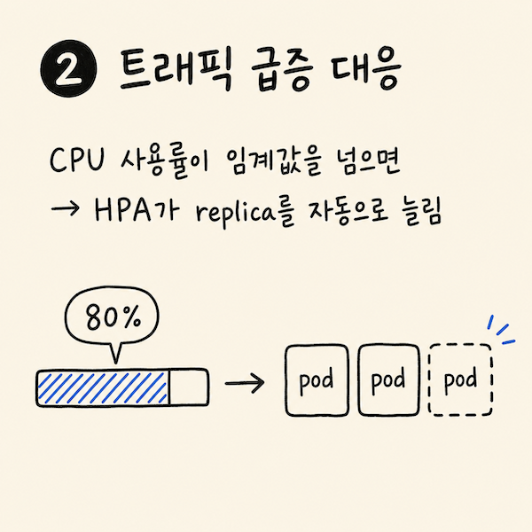
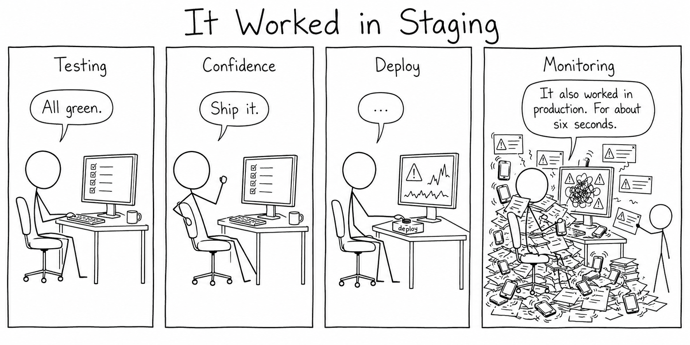
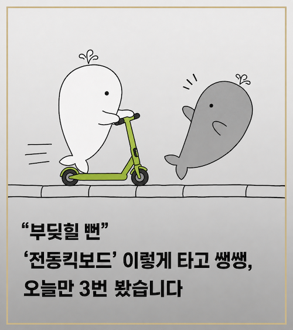
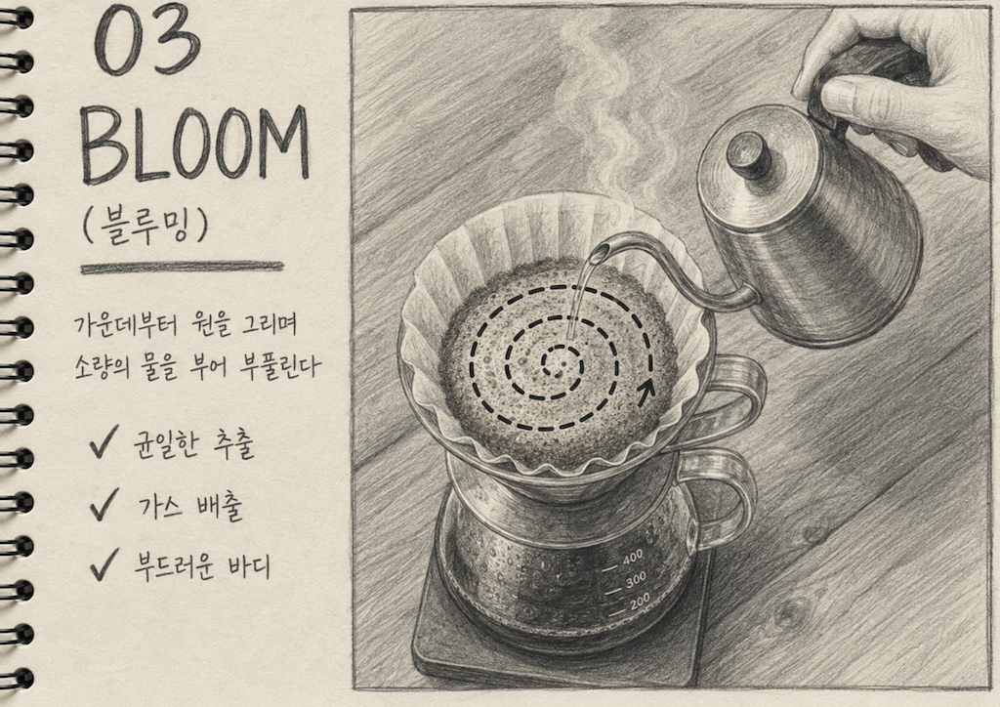
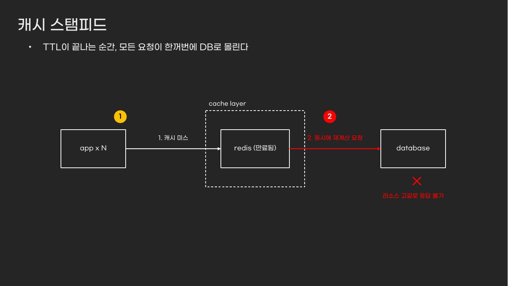

# akbun-aitools

akbun tools for both Claude Code and Codex plugin workflows.

## plugin 목록

설치 가능한 plugin과 각 plugin이 제공하는 skill이다. plugin이나 skill을 추가/삭제하면 이 목록도 함께 갱신한다(`AGENTS.md`의 플러그인 변경 규칙 참고).

### akbun-writing

글쓰기, 리뷰, 블로그 발행 지원 skill 모음.

| skill | 설명 |
|---|---|
| [akbun-writing](./plugins/akbun-writing/skills/akbun-writing/) | akbun 스타일 한국어 기술 블로그 작성·확장 |
| [akbun-writing-with-question](./plugins/akbun-writing/skills/akbun-writing-with-question/) | 질문 기반 akbun 스타일 학습형 블로그 작성 |
| [akbun-writing-persuasive](./plugins/akbun-writing/skills/akbun-writing-persuasive/) | 독자가 끝까지 읽고 납득하도록 설득식 구조로 akbun 스타일 블로그 작성 |
| [akbun-docs-reviewer](./plugins/akbun-writing/skills/akbun-docs-reviewer/) | 한국어 기술 문서 교정·용어 표기 표준화 리뷰 |
| [akbun-markdown-to-html-pandoc](./plugins/akbun-writing/skills/akbun-markdown-to-html-pandoc/) | Obsidian markdown을 pandoc으로 HTML 변환(블로그 업로드) |
| [akbun-md-to-notion](./plugins/akbun-writing/skills/akbun-md-to-notion/) | Obsidian markdown을 Notion Tasks DB로 전송 |
| [akbun-generate-headline](./plugins/akbun-writing/skills/akbun-generate-headline/) | 넘긴 내용·파일을 분석해 클릭을 부르는 헤드라인(글 제목) 후보 생성 |

### akbun-draw

이미지 그리기 skill 모음. 소재·글·코드를 akbun 고정 스타일의 이미지 생성 프롬프트와 Figma/Canva 편집용 SVG로 만든다.

| skill | 설명 |
|---|---|
| [akbun-generateimage-code](./plugins/akbun-draw/skills/akbun-generateimage-code/) | 코드 설명용 블로그 figure의 이미지 생성 프롬프트 작성 |
| [akbun-draw-webtoon-a](./plugins/akbun-draw/skills/akbun-draw-webtoon-a/) | 사용자 내용을 3~4컷 흑백 스틱피겨 웹툰의 이미지 생성 프롬프트로 작성 |
| [akbun-draw-webtoon-b](./plugins/akbun-draw/skills/akbun-draw-webtoon-b/) | 이미지·글로 파스텔 치비 동물 캐릭터 웹툰 페이지의 이미지 생성 프롬프트 + Figma/Canva용 텍스트 SVG 작성 |
| [akbun-draw-webtoon-c](./plugins/akbun-draw/skills/akbun-draw-webtoon-c/) | 글·이미지로 세로형 1컷 에세이툰(상단 내레이션+고래 마스코트 단일 장면) 페이지의 이미지 생성 프롬프트 + Figma/Canva용 텍스트 SVG 작성 |
| [akbun-draw-webtoon-d](./plugins/akbun-draw/skills/akbun-draw-webtoon-d/) | 실제 경험담을 인스타 세로형(3:4) 흑백 다큐툰(거친 잉크 낙서선+하단 자막 내레이션+얼굴 없는 실루엣 군중)의 장면별 이미지 생성 프롬프트로 작성 |
| [akbun-generate-sketch-text](./plugins/akbun-draw/skills/akbun-generate-sketch-text/) | 문구를 린넨 원단 자수 텍스트 + 형광펜 강조 스타일의 이미지 생성 프롬프트로 작성 |
| [akbun-draw-sketchbook-card](./plugins/akbun-draw/skills/akbun-draw-sketchbook-card/) | 개념을 연필 스케치북 카드(손글씨 제목·체크리스트+일러스트)로 그리는 이미지 생성 프롬프트 작성 |
| [akbun-draw-quiet-pencil](./plugins/akbun-draw/skills/akbun-draw-quiet-pencil/) | 아무 순간을 크림 배경+넓은 여백+회색 연필 소재+틸 소품 하나의 조용한 연필 스케치 장면 스타일로 그리는 이미지 생성 프롬프트 작성 |
| [akbun-draw-poster-monogray](./plugins/akbun-draw/skills/akbun-draw-poster-monogray/) | 아무 소재를 손그림 진회색 잉크+플랫 회색+오렌지 포인트 하나의 테크북 삽화 스타일로 그리는 이미지 생성 프롬프트와 Figma/Canva용 SVG 작성 |
| [akbun-draw-book-illustration](./plugins/akbun-draw/skills/akbun-draw-book-illustration/) | 소재·문구를 monogray 삽화 스타일 + 고정 레이아웃 5종(아이콘 스트립·확대·대화·흐름·포스터)과 상하좌우 간격으로 배치한 이미지 생성 프롬프트와 Figma/Canva용 SVG 작성 |
| [akbun-draw-cartoon-b](./plugins/akbun-draw/skills/akbun-draw-cartoon-b/) | 아무 상황을 회색 그라데이션+베이지 테두리+낙서풍 고래 캐릭터+올리브 포인트 하나의 이슈 카드뉴스 스타일로 그리는 이미지 생성 프롬프트와 Figma/Canva용 SVG 작성 |
| [akbun-draw-cardnews-cream](./plugins/akbun-draw/skills/akbun-draw-cardnews-cream/) | 아무 개념을 크림 배경+손글씨 제목·본문+낙서 다이어그램+파란 빗금 포인트 하나의 설명형 카드뉴스 스타일로 그리는 이미지 생성 프롬프트와 Figma/Canva용 SVG 작성 |
| [akbun-mascot-whale](./plugins/akbun-draw/skills/akbun-mascot-whale/) | akbun 마스코트 고래 캐릭터의 표준 외형 스펙(다른 그리기 skill이 참조) |
| [akbun-draw-electronicon](./plugins/akbun-draw/skills/akbun-draw-electronicon/) | 인터뷰로 앱 핵심 기능을 확인해 고래 마스코트 Electron 앱 아이콘의 이미지 생성 프롬프트 작성 + KB 압축·적용 안내 |

아래는 각 skill로 만든 예시다.

| skill | 이미지 |
|---|---|
| `akbun-mascot-whale` |  |
| `akbun-draw-cardnews-cream` |  |
| `akbun-draw-webtoon-a` |  |
| `akbun-draw-webtoon-b` |  |
| `akbun-draw-webtoon-c` |  |
| `akbun-draw-cartoon-b` |  |
| `akbun-draw-sketchbook-card` |  |

### akbun-draw-architecture

아키텍처 그리기 skill 모음. AWS/Kubernetes draw.io 다이어그램과 아키텍처·네트워크 흐름 그림 프롬프트를 만든다.

| skill | 설명 |
|---|---|
| [akbun-drawio-aws-vpc](./plugins/akbun-draw-architecture/skills/akbun-drawio-aws-vpc/) | draw.io로 AWS VPC 기초 다이어그램 생성 |
| [kubernets-network-drawio](./plugins/akbun-draw-architecture/skills/kubernets-network-drawio/) | draw.io로 Kubernetes 네트워크 다이어그램 생성 |
| [akbun-draw-component](./plugins/akbun-draw-architecture/skills/akbun-draw-component/) | 코드·컴퍼넌트를 분석해 하이레벨 아키텍처/연관관계 그림의 이미지 생성 프롬프트 작성 |

### akbun-learning

언어·학습 보조 skill 모음.

| skill | 설명 |
|---|---|
| [akbun-algorithm-tutor](./plugins/akbun-learning/skills/akbun-algorithm-tutor/) | 학습자 눈높이에 맞춘 알고리즘 문제 풀이·복잡도 과외 |
| [akbun-describe-twitter-transcript](./plugins/akbun-learning/skills/akbun-describe-twitter-transcript/) | x.com post 영상을 한국어 Markdown 대본으로 정리 |
| [akbun-describe-youtube-transcript](./plugins/akbun-learning/skills/akbun-describe-youtube-transcript/) | 유튜브 자막을 한국어 보고서로 정리 |
| [akbun-driven-learning](./plugins/akbun-learning/skills/akbun-driven-learning/) | 가설 검증형 학습자를 위한 기술 개념 설명 스타일(판정 우선·구조 시각화·연쇄 질문 대응) |
| [akbun-learning-english](./plugins/akbun-learning/skills/akbun-learning-english/) | 한국어 학습자용 영어 발음·읽기 가이드 |
| [akbun-learning-japanese](./plugins/akbun-learning/skills/akbun-learning-japanese/) | 한국어 학습자용 일본어 발음·읽기 가이드 |
| [akbun-make-anki-japanese](./plugins/akbun-learning/skills/akbun-make-anki-japanese/) | 일본어 교재 이미지/PDF를 Anki 덱으로 변환 |
| [akbun-studysheet](./plugins/akbun-learning/skills/akbun-studysheet/) | 주제·글·코드를 문제 상황 → 원리 → 구조 이해 → 핸즈온 흐름의 인터랙티브 HTML 학습지(20장 미만, 전체 light theme akbun 라이트 스타일)로 생성 |

### akbun-presentation

akbun 발표자료 스타일 skill 모음.

| skill | 설명 |
|---|---|
| [akbun-presentation-lightsandwich](./plugins/akbun-presentation/skills/akbun-presentation-lightsandwich/) | 주제·글·코드를 akbun 라이트 샌드위치 스타일 pptx 덱으로 생성 — 다크 표지·섹션+흰 내용 슬라이드+노란 세로 바+코드 패널+링크 푸터, 질문 훅 스토리와 노랑/빨강 강조 |
| [akbun-presentation-darkstep](./plugins/akbun-presentation/skills/akbun-presentation-darkstep/) | 주제·글·코드를 akbun 다크 스텝 스타일 pptx 덱으로 생성 — 전체 다크+슬라이드당 메시지 한 줄+흰 테두리 다이어그램, 질문 훅 스토리와 노랑/빨강 강조 |

아래는 skill로 만든 예시다.

| skill | 이미지 |
|---|---|
| `akbun-presentation` |  |

### akbun-analysis

코드베이스 분석 skill 모음. 어떤 비즈니스를 위해 코드가 쓰였는지를 file:line 근거가 있는 JSON으로 저장하고, 인터랙티브 HTML과 선택적 draw.io 관계도를 생성·증분 갱신한다.

| skill | 설명 |
|---|---|
| [akbun-analysiscode](./plugins/akbun-analysis/skills/akbun-analysiscode/) | 비즈니스 흐름·API·서비스 관계를 근거 기반 JSON으로 분석하고, 비즈니스·서비스·API 관계도와 fan-out 기반 부하 전파 화면을 가진 인터랙티브 HTML·draw.io로 시각화·증분 갱신 |

## skill 연관관계

일부 skill은 다른 skill의 정의를 참조한다. 참조 대상 skill을 바꾸면 참조하는 skill의 결과물도 함께 바뀐다.

- `akbun-mascot-whale`(akbun-draw): akbun 마스코트 고래의 표준 외형을 정의하는 기준 skill. 캐릭터를 그리는 아래 skill들이 이 스펙을 참조한다.
  - 캐릭터로 직접 사용: `akbun-draw-cartoon-b`, `akbun-draw-webtoon-b`, `akbun-draw-webtoon-c`
  - 인물이 필요할 때 사용: `akbun-draw-book-illustration`, `akbun-draw-poster-monogray`, `akbun-draw-sketchbook-card`

## 설치 방법

### Claude Code

Claude Code marketplace metadata lives in:

- `.claude-plugin/marketplace.json`
- `plugins/<plugin-name>/.claude-plugin/plugin.json`

기존 설치 방식은 그대로 유지한다.

```bash
/plugin marketplace add choisungwook/akbun-aitools
/plugin install akbun-writing@akbun-aitools
/plugin install akbun-draw@akbun-aitools
/plugin install akbun-draw-architecture@akbun-aitools
/plugin install akbun-learning@akbun-aitools
/plugin install akbun-presentation@akbun-aitools
/plugin install akbun-analysis@akbun-aitools
/reload-plugins
```

### Codex

Codex plugin 설치 명령어

```bash
codex plugin marketplace add choisungwook/akbun-aitools --json
codex plugin add akbun-learning@akbun-aitools --json
codex plugin add akbun-writing@akbun-aitools --json
codex plugin add akbun-draw@akbun-aitools --json
codex plugin add akbun-draw-architecture@akbun-aitools --json
codex plugin add akbun-presentation@akbun-aitools --json
codex plugin add akbun-analysis@akbun-aitools --json
```

Codex plugin 업그레이드

Codex에게 요청할 프롬프트

```text
akbun-aitools Codex plugin을 hard reset하세요.
```

Hard reset 명령어

```bash
codex plugin remove akbun-writing@akbun-aitools --json
codex plugin remove akbun-draw@akbun-aitools --json
codex plugin remove akbun-draw-architecture@akbun-aitools --json
codex plugin remove akbun-learning@akbun-aitools --json
codex plugin remove akbun-presentation@akbun-aitools --json
codex plugin remove akbun-analysis@akbun-aitools --json

rm -rf ~/.codex/plugins/cache/akbun-aitools
rm -rf ~/.codex/.tmp/marketplaces/akbun-aitools

codex plugin marketplace add choisungwook/akbun-aitools --json
codex plugin add akbun-writing@akbun-aitools --json
codex plugin add akbun-draw@akbun-aitools --json
codex plugin add akbun-draw-architecture@akbun-aitools --json
codex plugin add akbun-learning@akbun-aitools --json
codex plugin add akbun-presentation@akbun-aitools --json
codex plugin add akbun-analysis@akbun-aitools --json

codex plugin list --json
```

Codex plugin metadata lives in:

- `.agents/plugins/marketplace.json`
- `plugins/<plugin-name>/.codex-plugin/plugin.json`
