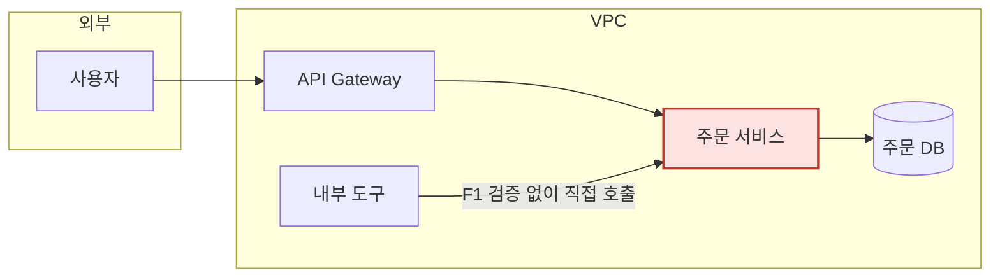

# akbun-analysis-architecture-review

이 skill은 현재 아키텍처를 **옹호하지 않는다**. 먼저 무너뜨릴 방법을 찾고, 그다음 더 나은 구조를 근거와 수치로 제안한다. 다만 판단은 사용자의 몫이다. 이 skill은 발견·대안·효과·감수할 것을 빠짐없이 놓아주되 결정을 대신 내리지 않는다.

"더 좋은 아키텍처"의 기준은 사용자마다 다르다. 그래서 인터뷰 없이 제안하지 않는다. 기술을 더 얹는 것을 개선으로 보지 않는다. 지우고 단순하게 만드는 대안을 먼저 찾고, 새 인프라 추가는 마지막 선택지로 둔다.

## 1. 컨텍스트가 있는지 확인한다

사용자가 무엇을 넘겼는지 먼저 목록으로 만든다. 없는 것을 추측으로 채우지 않는다.

| 항목 | 있음/없음 | 출처 |
|---|---|---|
| 코드·저장소 | | |
| 아키텍처 문서·그림 | | |
| 인프라 코드(Terraform, Kubernetes manifest, Dockerfile, CI) | | |
| 운영 자료(장애 기록, 온콜 절차, 런북, 알람 목록) | | |
| 규모 수치(RPS, 데이터 크기, 사용자 수, 월 비용) | | |
| 제약(예산, 규정, 팀 규모, 일정, 바꿀 수 없는 것) | | |

저장소가 있으면 `akbun-analysiscode`의 저장 분석을 재사용한다. 코드베이스를 다시 전면 탐색하지 않는다.

```bash
python3 <plugin-dir>/skills/akbun-analysiscode/scripts/locate_analysis.py <project-root>
```

`mode`가 `reuse` 또는 `incremental`이면 `paths.analysis`의 `components`·`relationships`·`apis`가 현재 아키텍처다. 저장 분석이 없으면 진입점, 서비스 경계, 데이터 저장소, 외부 호출, 인증·인가 위치만 최소로 직접 확인한다. 확인한 위치는 `file:line`으로 적는다.

컨텍스트가 하나도 없으면 평가를 시작하지 않고 2단계 인터뷰로 아키텍처 자체를 먼저 받아 적는다. 이때 사용자가 말한 구조를 mermaid로 그려 "이게 맞나"를 확인받은 뒤 진행한다.

## 2. 적극적으로 인터뷰한다

목표와 제약을 모르면 "더 좋은"을 판정할 수 없다. 자료에서 확인된 것은 묻지 않고, 확인되지 않은 것만 묻는다. 한 번에 5개 이하로 묻고, 답에서 새 의문이 생기면 후속 질문한다. 3라운드 안에 끝내고, 그래도 빈 곳은 가정을 명시하고 진행한다.

질문 묶음(`references/review-lenses.md`의 인터뷰 표에서 고른다):

- **지켜야 할 것**: 가용성·지연·비용 상한·규정 중 무엇이 깨지면 안 되는가
- **아픈 곳**: 최근 장애, 반복되는 수작업, 배포가 두려운 곳, 온콜에서 자주 오는 알람
- **보안**: 외부에 열린 면, 인증·인가가 어디서 이뤄지는가, 비밀은 어디에 있는가, 다루는 데이터의 민감도
- **운영**: 배포 단계 수, 롤백 방법, 스케일 방법, 사람이 손으로 하는 절차 목록
- **제약**: 바꿀 수 없는 것과 그 이유(레거시, 계약, 팀 역량, 예산, 일정)
- **규모**: 지금 수치와 1년 뒤 예상

인터뷰가 끝나면 평가 기준을 표로 확정하고 사용자에게 보여준다. 이 표가 3단계 이후의 잣대다.

| 기준 | 현재 | 목표 | 출처 |
|---|---|---|---|
| 배포 단계 수 | 수작업 7단계 | 3단계 이하 | 인터뷰 |
| 외부 노출 포트 | 5개 | 2개 | `infra/sg.tf:12` |

## 3. 적대적으로 평가한다

`references/review-lenses.md`의 렌즈를 순서대로 댄다. **보안**과 **운영·유지보수 부담(toil)**은 반드시 다루고, 나머지(장애·복구, 변경 비용, 비용, 확장성)는 이 시스템에 해당할 때 다룬다.

렌즈마다 "이 구조를 무너뜨리려면 어떻게 하는가"를 구체적 시나리오로 쓴다. "보안이 약할 수 있다"는 발견이 아니다. "`api/auth.py:40`의 토큰 검증이 게이트웨이가 아니라 서비스 안에 있어서, 내부 네트워크에 들어온 요청은 검증 없이 `order-service`를 직접 호출할 수 있다"가 발견이다.

발견마다 아래를 채운다.

- 근거: `file:line`, 문서 위치, 또는 인터뷰 답변. 근거가 없으면 발견에서 뺀다.
- 영향: 무엇이 얼마나 나빠지는가
- 발생 가능성: 지금 조건에서 얼마나 쉬운가

현재 구조가 **잘 지키고 있는 것**도 같이 적는다. 대안이 그것을 깨뜨리면 안 되기 때문이다.

발견은 영향 × 발생 가능성으로 정렬하고 3~7개로 제한한다. 그 이상은 핵심이 묻힌다.

## 4. 대안을 설계하고 수치로 비교한다

발견마다 대안을 1~2개 놓는다. 변경 범위가 작은 것부터 쓴다. 설정·권한 변경 → 경계 이동 → 구성 요소 제거·통합 → 새 구성 요소 추가 순이 보통이다.

대안마다 아래를 쓴다.

- 무엇을 바꾸는가: 구성 요소·경계·호출 순서 중 무엇이 달라지는가
- 왜 더 좋은가: 아래 수치 표
- 새로 감수하는 것: 대안이 만드는 새 문제와 그것이 이 시스템의 어디에 생기는지
- 이행 순서: 한 번에 갈아엎지 않고 단계적으로 옮기는 순서와 각 단계에서 되돌리는 방법

개선 효과는 반드시 표로 쓴다. 지표는 `references/review-lenses.md`의 지표 목록에서 고른다.

| 지표 | 현재 | 개선 후 | 산출 근거 |
|---|---|---|---|
| 외부 노출 포트 수 | 5 | 2 | `sg.tf` ingress 규칙 수 |
| 비밀이 놓인 위치 수 | 4(환경변수·설정 파일·CI 변수·코드) | 1(Secrets Manager) | 인터뷰 + `config/*.yaml` |
| 배포 단계 중 수작업 | 7단계 중 4 | 7단계 중 0 | 런북 `deploy.md` |
| 단일 장애점 수 | 2 | 0 | 현재 mermaid의 노드 |

수치는 세 종류로 구분해 적는다.

- 센 값: 코드·설정·문서에서 직접 센 것. 그대로 쓴다.
- 측정값: 사용자가 준 것(RPS, 비용, 장애 횟수). 출처를 쓴다.
- 추정값: 위 둘로 계산한 것. `추정`이라고 표시하고 산출식을 쓴다.

세 종류 어디에도 못 넣는 숫자는 쓰지 않는다. "약 50% 개선" 같은 근거 없는 비율을 쓰지 않는다.

대안마다 **보안 관점**과 **운영 부담 관점**을 각각 한 줄씩 반드시 남긴다. 개선이 없으면 "변화 없음", 나빠지면 나빠진다고 쓴다.

## 5. 필요할 때 mermaid로 그린다

그림은 말로 설명하기 어려울 때만 그린다. 아래 조건에 맞으면 그린다.

| 조건 | 그림 |
|---|---|
| 구성 요소나 경계가 바뀜 | `flowchart` 현재/개선 후 두 장. 신뢰 경계는 `subgraph`로 |
| 호출 순서나 인증 시점이 바뀜 | `sequenceDiagram` 현재/개선 후 두 장 |
| 데이터가 지나는 곳이 바뀜 | `flowchart`에 데이터 흐름 엣지, 민감 데이터는 라벨로 표시 |

규칙:

- 노드는 사람이 부르는 이름(주문 서비스, 주문 DB)으로 쓰고 클래스·함수명은 쓰지 않는다. 15개를 넘지 않게 묶는다.
- 발견 위치는 `classDef finding`, 개선 후 달라진 부분은 `classDef changed`, 새로 감수하는 문제 위치는 `classDef newrisk`로 표시하고 엣지 라벨에 발견 번호를 붙인다.
- 그림 위에 무엇을 그린 것인지 한 줄, 아래에 그림에서 봐야 할 것 1~3줄을 쓴다.



## 6. 문서 구조

결과는 아래 순서의 Markdown 하나로 낸다. 사용자가 저장 경로를 말하면 그 파일로 쓰고, 말하지 않으면 대화에 출력한다. 프로젝트 저장소에 임의로 파일을 만들지 않는다.

```markdown
# {시스템} 아키텍처 적대적 평가

## 전제와 평가 기준
받은 컨텍스트 목록, 인터뷰로 확정한 기준 표, 명시한 가정

## 현재 아키텍처
mermaid + 잘 지키고 있는 것 + 발견 요약 표(번호 · 렌즈 · 한 줄 · 영향 · 발생 가능성)

## F1. {발견 제목}
### 무너뜨리는 시나리오
### 근거
### 대안
### 개선 효과
### 새로 감수하는 것
### 이행 순서

## F2. ...

## 개선 후 아키텍처
mermaid(+ 필요 시 sequenceDiagram) + 보안·운영 부담 종합 표(현재 vs 개선 후)

## 사용자가 판단할 것
대안 선택, 이행 시점, 감수할 것 중 이 문서가 결정하지 않은 항목
```

## 하지 않는 것

- 코드·인프라를 수정하지 않는다. 사용자가 적용을 따로 요청하면 그때 선택된 대안만 적용한다.
- 근거 없는 발견을 쓰지 않는다. `file:line`, 문서 위치, 인터뷰 답변 중 하나가 없으면 뺀다.
- 인터뷰 없이 제안하지 않는다. 컨텍스트가 충분해 보여도 지켜야 할 것과 제약은 확인한다.
- 유행하는 기술로 바꾸는 것을 개선으로 보지 않는다. 지표가 좋아지지 않는 대안은 쓰지 않는다.
- 코드 품질·스타일을 평가하지 않는다. 구조와 경계만 다룬다.
- 침투 테스트나 부하 테스트를 실행하지 않는다. 시나리오와 확인 방법만 적는다.
