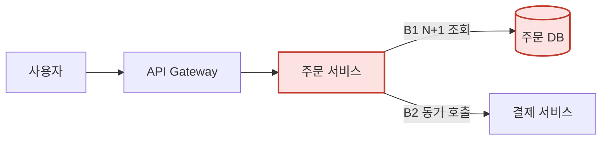

# akbun-analysis-bottleneck

이 skill은 성능을 고치지 않는다. **트래픽이 늘면 어디가 먼저 막히는지**를 코드 근거로 예측하고, 그 병목을 만났을 때 개발자가 순서대로 겪어야 할 것을 문서로 남긴다.

1. 무엇을 측정해야 하는지
2. 여러 해결책 중 지금 무엇을 선택하는지, 장애 중에는 어디까지 바꿔도 되는지
3. 개선한 뒤 어떤 문제가 새로 생기는지

AI는 해결책을 여러 개 낼 수 있다. 하지만 **선택, 선택이 만드는 새 문제, 장애 상태에서 변경 허용 범위의 판단은 개발자의 몫**이다. 이 skill은 그 판단에 필요한 근거와 선택지를 빠짐없이 놓아주되, 판단을 대신 내리지 않는다. 기술을 더 얹는 것이 목적이 아니다. 해결책 목록에서 새 인프라 추가는 마지막 선택지로 둔다.

## 1. 요청 트래픽 경로를 확보한다

먼저 `akbun-analysiscode`의 저장 분석을 재사용한다.

```bash
python3 <plugin-dir>/skills/akbun-analysiscode/scripts/locate_analysis.py <project-root>
```

`mode`가 `reuse` 또는 `incremental`이면 `paths.analysis`의 `businesses`·`components`·`relationships`·`apis`를 읽는다. 플로우 `steps`가 곧 요청 경로이고, `origin.type`이 `database`인 컴포넌트가 공유 자원이다. 코드베이스를 다시 전면 탐색하지 않는다.

저장 분석이 없으면 이 skill 안에서 최소한으로 직접 추적한다. 라우팅 테이블·컨슈머 등록·스케줄러에서 **진입점 목록**을 모으고, 트래픽이 몰릴 진입점부터 진입점 → 서비스 → 리포지토리·클라이언트 → DB·브로커·외부 API까지 호출을 따라간다. 트래픽이 몰릴 진입점은 사용자가 말해준 것, 없으면 읽기 목록·상세 조회·로그인·결제 같은 사용자 반복 동작으로 추정하고 추정임을 문서에 적는다.

각 경로에서 아래를 코드에서 확인한다. 확인한 위치는 `file:line`으로 적는다.

- 반복 안의 I/O (루프 안 쿼리·HTTP 호출·N+1)
- 동기 외부 호출과 그 타임아웃·재시도 설정
- 커넥션 풀·스레드 풀·워커 수 같은 **상한이 있는 자원**의 설정값
- 트랜잭션 범위와 락 (`SELECT ... FOR UPDATE`, 낙관적 락 재시도, 분산 락)
- 인덱스 없는 조건·정렬·`COUNT(*)`·`OFFSET` 페이지네이션
- 캐시 유무, TTL, 캐시 미스 시 경로
- 여러 서비스가 공유하는 단일 자원 (한 DB, 한 큐, 한 외부 API 키)
- 단일 인스턴스로만 동작해야 하는 코드 (인메모리 상태, 스케줄러, 순서 보장 컨슈머)

## 2. 병목 후보를 고른다

`references/bottleneck-catalog.md`의 패턴 표에 1단계 관찰을 대조해 후보를 만든다. 후보는 **트래픽이 늘 때 먼저 터지는 순서**로 정렬한다. 기준은 두 가지다.

- 트래픽 배수에 비례해서 커지는 비용인가 (요청당 쿼리 수, 요청당 외부 호출 수)
- 상한이 정해진 공유 자원에 닿는가 (커넥션 풀, DB CPU, 외부 API rate limit, 단일 파티션)

둘 다 해당하면 최우선이다. 근거 없이 "DB가 느릴 수 있다"처럼 일반론으로 쓰지 않는다. 코드에서 확인하지 못한 병목은 후보에서 뺀다.

후보는 3~5개로 제한한다. 그 이상은 핵심이 묻힌다.

## 3. 후보마다 다섯 항목을 채운다

각 병목은 아래 순서를 그대로 문서에 쓴다. 이 순서가 개발자가 실제로 겪는 순서다.

### 3-1. 어디서, 왜

- 위치: `file:line`, 관련 MSA(서비스 이름), 닿는 DB·테이블·브로커·외부 API
- 메커니즘: 트래픽이 N배가 되면 이 코드에서 무엇이 N배·N²배가 되는지 한두 문장

### 3-2. 무엇을 측정하는가

절대값이 아니라 **단위 작업당 비용**으로 적는다. 측정 항목마다 어디서 보는지(APM, DB 통계 뷰, 브로커 지표, 애플리케이션 로그)와 어떤 값이 나오면 이 가설이 맞는지 적는다.

| 측정 항목 | 어디서 보는가 | 병목이면 보이는 값 |
|---|---|---|
| DB queries/request | APM 트레이스, `pg_stat_statements` calls | 목록 크기에 비례해 증가 |
| pool wait time | 커넥션 풀 지표(HikariCP `pending`, pgbouncer `cl_waiting`) | 트래픽과 함께 0에서 급증 |

부하 테스트로 재현하는 방법을 한 단락으로 적는다. 어떤 진입점을, 어떤 데이터 조건(목록 100건 vs 10건)으로, 어떤 램프 프로파일(예: 10 → 200 RPS, 5분)로 치는지. 스크립트 전체를 쓰지 않는다. 도구는 저장소에 이미 있는 것(k6, locust, JMeter, wrk)을 우선하고 없으면 하나만 제안한다.

### 3-3. 장애가 났을 때 확인 순서

장애 중에 볼 것을 **순서대로** 적는다. 각 줄에 무엇을 보고 어떤 값이면 다음으로 넘어가는지 적는다.

1. 트래픽: 어느 진입점(API path)이 늘었는지, 정상 구간 대비 몇 배인지
2. MSA: 어느 서비스의 p99·에러율·스레드 풀 포화가 먼저 올랐는지
3. DB·공유 자원: 활성 커넥션, 락 대기, 느린 쿼리 상위, replication lag
4. 코드: 위 값이 가리키는 `file:line`과 그 설정값

정상 구간과 장애 구간을 항상 비교한다. 장애 시점 값만 보면 원인이 보이지 않는다.

### 3-4. 해결책과 선택

해결책을 **2개 이상** 표로 놓는다. 변경 범위가 작은 것부터 쓴다. 설정 변경 → 쿼리·코드 수정 → 캐시·비동기 → 인프라 추가 순이 보통이다.

| 해결책 | 변경 범위 | 효과 | 새로 감수하는 것 | 장애 중 적용 |
|---|---|---|---|---|
| 풀 크기 상향 | 설정 1줄 | 즉시, 한계 있음 | DB 커넥션 총량 초과 | 가능 |
| 배치 조회로 N+1 제거 | 코드 1~2파일 | 근본 | 배포 필요 | 배포 창 확보 시 |

그다음 두 가지를 개발자에게 넘긴다.

- **지금 선택할 것과 이유**: 추천 1개를 적되 "현재 트래픽 X배 이내면 A, 그 이상이면 B"처럼 조건을 붙인다.
- **장애 중 변경 허용 범위**: 장애 상태에서 즉시 해도 되는 것(설정·플래그·스케일아웃)과 하지 말아야 하는 것(스키마 변경·큐 도입·캐시 무효화 정책 변경)을 구분한다. 되돌리기 어려운 변경은 장애 중에 하지 않는 쪽으로 적는다.

### 3-5. 해결 과정 서술과 개선 뒤 새 문제

"어떻게 해결했는가"를 한 단락으로 서술한다. 순서는 **측정 → 선택 → 변경 → 재측정**이다. 재측정에서 3-2의 같은 지표가 어떻게 바뀌어야 성공인지 적는다.

이어서 **개선 뒤 새로 생기는 문제**를 적는다. 카탈로그의 "새로 생기는 문제" 열을 근거로 하되, 이 코드베이스에서 실제로 어디에 생기는지 `file:line` 또는 컴포넌트로 지목한다. 마지막에 **다음 병목이 어디로 옮겨가는지** 한 줄로 적는다. 병목은 없어지지 않고 옮겨간다.

## 4. 아키텍처를 mermaid로 그린다

두 장을 그린다. 두 장 모두 트래픽 진입점에서 시작해 요청 방향으로 흐르게 한다.

- **현재 아키텍처**: 진입점 → 서비스 → DB·브로커·외부 API. 병목 후보 노드와 엣지를 `classDef bottleneck`으로 표시하고 엣지 라벨에 병목 번호를 붙인다.
- **개선 후 아키텍처**: 추천 해결책을 적용한 모습. 새로 생기는 문제 위치를 `classDef newrisk`로 표시한다.

노드는 사람이 부르는 이름(주문 서비스, 주문 DB)으로 쓰고 클래스·함수명은 쓰지 않는다. 노드는 15개를 넘지 않게 묶는다.



## 5. 문서 구조

결과는 아래 순서의 Markdown 하나로 낸다. 사용자가 저장 경로를 말하면 그 파일로 쓰고, 말하지 않으면 대화에 출력한다. 프로젝트 저장소에 임의로 파일을 만들지 않는다.

```markdown
# {프로젝트} 트래픽 증가 병목 분석

## 전제
분석 대상 진입점, 추정한 트래픽 패턴, 재사용한 분석(analysis.json 유무)

## 현재 아키텍처
mermaid + 병목 후보 요약 표(번호 · 위치 · 먼저 터지는 이유)

## B1. {병목 이름}
### 어디서, 왜
### 무엇을 측정하는가
### 장애가 났을 때 확인 순서
### 해결책과 선택
### 해결 과정과 개선 뒤 새 문제

## B2. ...

## 개선 후 아키텍처
mermaid + 다음 병목이 옮겨가는 곳

## 개발자가 판단할 것
선택·장애 중 변경 범위 중 이 문서가 결정하지 않은 항목 목록
```

## 하지 않는 것

- 코드를 수정하지 않는다. 사용자가 해결책 적용을 따로 요청하면 그때 3-4에서 선택된 항목만 적용한다.
- 근거 없는 병목을 쓰지 않는다. `file:line` 또는 설정 파일 위치가 없으면 후보에서 제외한다.
- 코드 품질·스타일을 평가하지 않는다. 트래픽과 무관한 문제는 다루지 않는다.
- 부하 테스트를 실행하지 않는다. 재현 방법만 적는다.
