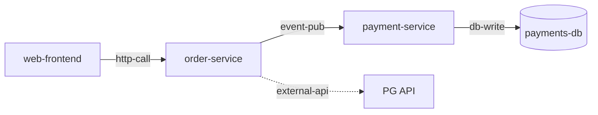

# 지식 저장소 형식

akbun-analysiscode가 만들고 읽는 영구 저장소의 계약이다. 여기 정의된 경로·스키마·필드는 agent 간 상호운용을 위한 최소 고정 지점이다. 그 위에 무엇을 더 기록할지는 자유이며, 확장할 때는 추가만 하고 기존 항목의 의미를 바꾸지 않는다.

## 디렉터리 레이아웃

저장소 루트(OS별 경로는 SKILL.md 참조) 아래 구조는 다음과 같다.

```text
<저장소 루트>/
  projects.json                  # 분석된 프로젝트 레지스트리 — 프로젝트 간 연결의 출발점
  projects/<project-id>/
    meta.json                    # 이 프로젝트 분석의 신선도와 요약
    graph.sqlite                 # 관계 그래프 (아래 스키마)
    wiki/
      index.md                   # 입구 문서 — 활용 모드에서 항상 먼저 읽는다
      architecture.md            # 전체 mermaid 그래프 + 구조 트리 + 주요 데이터 흐름
      services/<service>.md      # 서비스별 상세 페이지
      decisions/0001-slug.md     # ADR (번호 증가)
```

`project-id`는 `<repo이름 slug>-<해시 8자리>`다. 해시는 git remote URL(없으면 절대 경로)의 sha256 앞 8자리로, `scripts/init_store.py`가 계산한다. 같은 repo는 어디서 분석해도 같은 저장소를 쓰게 된다.

## meta.json

프로젝트 분석의 신선도 판단 기준이다. 예시:

```json
{
  "schema_version": 1,
  "project_id": "order-platform-3fa2b91c",
  "name": "order-platform",
  "root_path": "/Users/akbun/dev/order-platform",
  "remote": "https://github.com/akbun/order-platform.git",
  "analyzed_commit": "8c1f0d2e57a9...",
  "analyzed_at": "2026-08-06T12:00:00+00:00",
  "counts": {"nodes": 12, "edges": 31, "wiki_pages": 9}
}
```

- `analyzed_commit`이 `null`이면 초기화만 되고 분석 전이다.
- 분석·갱신을 마칠 때마다 `analyzed_commit`, `analyzed_at`, `counts`를 갱신한다.

## projects.json

같은 저장소 루트에 분석된 프로젝트들의 레지스트리다. 프로젝트 간 edge를 이을 때 여기서 상대 `project_id`를 찾는다. `init_store.py`가 자동으로 등록·갱신한다.

```json
{
  "schema_version": 1,
  "projects": [
    {
      "project_id": "order-platform-3fa2b91c",
      "name": "order-platform",
      "root_path": "/Users/akbun/dev/order-platform",
      "remote": "https://github.com/akbun/order-platform.git",
      "last_analyzed_at": "2026-08-06T12:00:00+00:00",
      "registered_at": "2026-08-01T09:00:00+00:00"
    }
  ]
}
```

## SQLite 스키마 (graph.sqlite)

`init_store.py`가 아래 DDL로 생성한다. 수동으로 만들 때도 동일하게 만든다.

```sql
CREATE TABLE IF NOT EXISTS meta (
  key   TEXT PRIMARY KEY,
  value TEXT NOT NULL
);

CREATE TABLE IF NOT EXISTS nodes (
  name      TEXT PRIMARY KEY,   -- 서비스/컴포넌트 이름 (소문자-하이픈)
  kind      TEXT NOT NULL,      -- 아래 node kind 어휘
  role      TEXT,               -- 비즈니스 역할 1~2문장
  path      TEXT,               -- repo 루트 기준 소스 위치
  wiki_page TEXT                -- wiki/ 기준 상대 경로 (예: services/order-service.md)
);

CREATE TABLE IF NOT EXISTS edges (
  source         TEXT NOT NULL,             -- nodes.name
  target         TEXT NOT NULL,             -- nodes.name (target_project가 있으면 그 프로젝트의 node)
  kind           TEXT NOT NULL,             -- 아래 edge kind 어휘
  detail         TEXT,                      -- 무엇을 주고받는지 짧게
  evidence       TEXT,                      -- 근거 file:line
  target_project TEXT NOT NULL DEFAULT '',  -- ''이면 같은 프로젝트, 아니면 상대 project_id
  UNIQUE (source, target, kind, target_project)
);

CREATE TABLE IF NOT EXISTS files (
  path TEXT PRIMARY KEY,   -- repo 루트 기준 상대 경로. 디렉터리 매핑이면 끝에 /
  node TEXT NOT NULL       -- nodes.name
);
```

- `files`는 변경 파일 → 영향 node를 찾기 위한 매핑이다. 서비스 디렉터리 단위(`services/order/` 형태)로 넣는 것을 우선하고, 경계가 갈리는 개별 파일만 파일 단위로 넣어 테이블을 작게 유지한다.
- `meta` 테이블에는 `schema_version`이 들어 있다. kind 어휘를 확장하면 `kind:<이름>` key로 짧은 설명을 남겨 다음 agent가 알게 한다.

### kind 어휘

출발점으로 쓰는 권장 어휘다. 코드베이스에 맞는 kind를 추가해도 된다.

| 구분 | 값 |
|---|---|
| node kind | `service`, `module`, `job`, `frontend`, `library`, `datastore`, `queue`, `external` |
| edge kind | `http-call`, `grpc-call`, `event-pub`, `event-sub`, `queue-produce`, `queue-consume`, `db-read`, `db-write`, `import`, `config`, `external-api` |

### 예시 쿼리

직접 의존자 — X를 바꾸면 바로 영향받는 쪽:

```sql
SELECT source, kind, detail, evidence
FROM edges
WHERE target = 'order-service' AND target_project = '';
```

전이 영향도 — 재귀 CTE로 역방향 도달 가능한 모든 의존자:

```sql
WITH RECURSIVE affected(name) AS (
  VALUES ('order-service')
  UNION
  SELECT e.source
  FROM edges e JOIN affected a ON e.target = a.name AND e.target_project = ''
)
SELECT n.name, n.kind, n.role
FROM nodes n JOIN affected a ON n.name = a.name
WHERE n.name <> 'order-service';
```

바뀐 파일 → 영향받은 node (`:changed`는 repo 루트 기준 상대 경로):

```sql
SELECT DISTINCT node
FROM files
WHERE path = :changed
   OR (path LIKE '%/' AND :changed LIKE path || '%');
```

## wiki 형식

아래 뼈대는 시작점이다. 내용이 요구하면 섹션을 바꿔도 되지만, `index.md`의 서비스 표와 "프로젝트 간 연결" 섹션은 다음 agent가 찾는 고정 지점이므로 유지한다. 모든 페이지는 다음 LLM agent가 독자다. 밀도 있게, 근거(file:line)와 함께 쓴다.

### index.md

목적: 이것 하나만 읽고 대부분의 구조·역할 질문에 답하기. 뼈대:

```markdown
# {프로젝트 이름}

{이 시스템이 비즈니스에서 무엇을 담당하는지 한두 문장}

## 서비스

| 서비스 | kind | 비즈니스 역할 | 페이지 |
|---|---|---|---|
| order-service | service | 주문 생성·상태 관리 | services/order-service.md |

## 핵심 그래프

(서비스 간 주요 흐름만 담은 mermaid 블록. 전체 그래프는 architecture.md)

## 프로젝트 간 연결

{다른 project_id·external 시스템과의 관계 목록. 없으면 "없음"}

## 읽기 안내

{어떤 질문이면 어느 페이지나 쿼리로 갈지 한두 줄}
```

### architecture.md

전체 mermaid 그래프(큰 시스템은 도메인별 subgraph로 분할), 디렉터리 → 서비스 매핑 트리, 대표 데이터 흐름 시나리오 2~3개를 담는다.

### services/&lt;service&gt;.md

서비스 하나의 상세 페이지. 뼈대:

```markdown
# {서비스 이름}

{비즈니스 역할 1~2문장}

## 하는 일

{엔트리포인트, 핵심 파일, 노출 API/이벤트 — 목록 위주}

## 의존한다 (out)

| 대상 | kind | 무엇 | evidence |
|---|---|---|---|

## 의존받는다 (in)

| 출처 | kind | 무엇 | evidence |
|---|---|---|---|

## 리스크 메모

{테스트 유무, 취약 지점, 변경 시 주의사항}
```

### decisions/NNNN-slug.md

되돌리기 어렵고, 맥락 없이는 이상해 보이고, 실제 트레이드오프가 있었던 결정만 남긴다. 형식은 제목 + 상황·결정·이유 1~3문장이다.

### mermaid 표기

edge label에 kind를 쓰고, 아직 분석되지 않은 외부 시스템은 점선으로 구분한다. 예시:



## 수동 초기화 (python 없이)

1. 위 레이아웃대로 디렉터리를 만든다.
2. `sqlite3` CLI로 위 DDL을 실행한다. sqlite도 쓸 수 없으면 wiki만이라도 만든다 — 그래프 질문은 서비스 페이지의 의존 표로 답할 수 있다.
3. `meta.json`과 `projects.json`을 위 형식대로 직접 작성한다.
