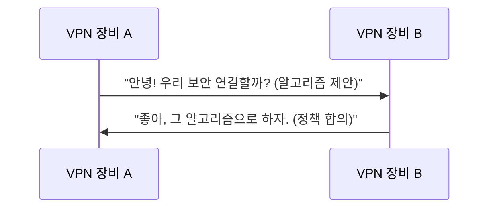

# Writing Techniques

- akbun의 기술 글쓰기 기법
- 기술 개념을 설명하고 콘텐츠를 구조화하는 방법을 정리한다

## Decomposition Technique

- 복합 용어를 구성 요소로 분해하고, 각각을 설명한 뒤, 다시 합쳐서 전체를 설명하는 기법
- akbun의 대표적인 교육 장치이지만, **남용하지 않는다**
- 용어가 의미 있는 하위 개념들로 구성되어 있고, 분해를 통해 단계적 이해를 쌓을 수 있을 때 효과적이다
- 이미 잘 알려진 용어거나 자명한 경우, 분해는 불필요한 길이만 늘릴 뿐이다

**사용하는 경우:**

- 용어가 2개 이상의 개별 개념으로 구성되어 있고, 각각 설명이 필요할 때 (예: "Site to Site VPN" = Site + Site to Site + VPN)
- 독자가 하위 구성 요소 중 하나 이상을 모를 가능성이 있을 때
- 분해가 실제로 단계적 이해에 도움이 될 때

**사용하지 않는 경우:**

- 이미 널리 알려진 용어일 때 (예: "API Gateway", "Load Balancer")
- 하위 요소가 전체 이해에 개별적으로 기여하지 않을 때
- 한 줄 정의로 충분할 때

예시:

```text
Site to Site VPN은 두 가지 단어를 합친 용어입니다. Site to Site + VPN
1. Site: 네트워크 영역을 의미합니다.
2. Site to Site: 두개 이상의 네트워크 영역을 연결하는 의미
3. VPN: Virtual Private Network의 약어로 가상 사설 네트워크
4. Site to Site VPN: 물리적으로 떨어진 두 개 이상의 네트워크 영역을 VPN으로 연결
```

- 복잡한 개념에는: "말이 어려운데 핵심 키워드는 N개입니다" → 키워드를 나열하고 각각 설명한다

## Definition-First

- 모든 새로운 개념은 깊은 설명에 앞서 한 줄 정의를 먼저 제시한다
- 예시: "mTLS는 상호(mutual)와 TLS가 합쳐진 개념으로, **서버와 클라이언트가 서로 신원을 확인하는 프로토콜**입니다."
- 패턴: **영어 약어(Full English Name)** + 같은 문장 안에서 한국어 설명

## Bold Key Statements

- 섹션당 가장 중요한 1~2개의 핵심 문장만 굵게 표시한다
- 해당 섹션의 요약 역할을 한다
- 예시: **readines probe는 pod가 요청을 받을 수 있는지 검사합니다.**

## Question-Driven Headings

- 질문을 섹션 제목으로 사용한다 — akbun의 매우 특징적인 패턴이다
  - "왜 헬스체크가 실패했을까?"
  - "왜 4번 후보가 잘못된 선택이었을까?"
  - "왜 node controller은 바로 노드 상태를 업데이트 하지 않을까요?"
  - "lease가 만료되면 무슨 일이 일어날까?"
- 문단 내 전환에도 질문을 활용한다
  - "그런데, 헬스체크가 실패한다면 pod에 문제 있어서 실패한걸까요?"

## Analogies

- 독자가 이미 아는 것에 비유하여 설명한다
  - "webhook처럼 kernel 특정 event가 발생할 때 실행됩니다"
  - "docker를 쉽게 사용할 수 있도록 도와주는 docker desktop과 비슷한 기능"
  - "Linux netfilter를 CLI로 설정할 수 있게 하는 것이 iptables입니다. 마찬가지로..."

## Caveats 섹션

- 개념을 설명한 뒤, 흔한 오해를 명시적으로 짚어준다
  - "Site to Site VPN을 헷갈리면 안되는 점"
  - "애플리케이션 헬스체크 설정은 정답이 없다"

## 문장 및 문단 패턴

- **짧은 서술문** — 1~2개의 절로 구성. "site는 네트워크 영역을 의미합니다."
- **짧은 문단** — 문단당 1~3 문장. 긴 블록을 만들지 않는다
- **정의-부연 쌍** — 한 문장이 정의하고, 다음 문장이 부연한다
- **능동태** — 직접적인 서술. 수동태를 피한다
- **접속사 활용** — "따라서", "즉", "반면", "마찬가지로", "그런데", "그래서", "하지만", "결국"
- **"정리하면" 패턴** — 설명 마무리에 사용할 수 있지만, 매 섹션마다 반복하면 단조로워진다. 글 전체에서 1~2회, 핵심 개념을 최종 정리할 때만 사용한다. 나머지는 "따라서", "즉", "결국" 등 다른 접속사를 활용한다

## 코드 블록

- 짧게 유지한다 — 보통 2~10줄
- 패턴: **산문 설명 → 코드 블록 → 결과 설명 또는 스크린샷**
- 언어 식별자를 사용한다 — `bash`/`sh`, `yaml`, `hcl`, `typescript`, `mermaid`

## 아키텍처 다이어그램

- akbun은 PowerPoint로 아키텍처 다이어그램을 적극적으로 그린다
- 글을 작성할 때는 항상 다이어그램 위치를 표시한다
- `[아키텍처 그림: {설명}]` 형식의 placeholder를 사용한다
- 패턴: 다이어그램을 먼저 보여주고, 이후에 상세 설명을 한다

## Mermaid 다이어그램

- 프로토콜 흐름에는 `sequenceDiagram`을 사용한다
- 메시지를 대화체 한국어로 작성하는 것이 akbun의 특징적인 기법이다

예시:


